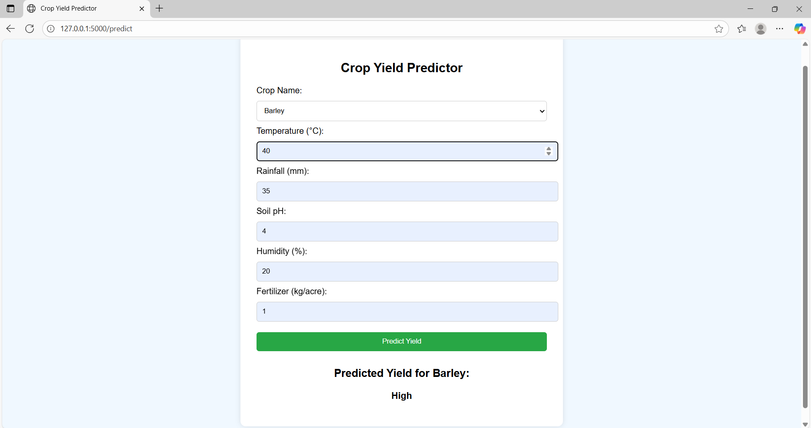

# 🌱 Crop Yield Prediction

This project is a **Flask-based web application** that predicts crop yield categories (**High, Medium, Low**) based on crop type, soil conditions, weather parameters, and fertilizer usage.
It uses a **Decision Tree Classifier** trained on agricultural data.


## 🚀 Features

* Input crop name, temperature, rainfall, soil pH, humidity, and fertilizer usage.
* Predicts whether the crop yield will be **High, Medium, or Low**.
* User-friendly **Flask web interface**.
* Encodes categorical variables automatically using `LabelEncoder`.


## 🛠️ Tech Stack

* **Python** (Flask, Pandas, Scikit-learn)
* **Machine Learning**: Decision Tree Classifier
* **Frontend**: HTML (via Flask templates)


## 📂 Project Structure

├── app.py                # Main Flask application
├── templates/
│   └── index.html        # Frontend template for user input/output
├── requirements.txt      # Project dependencies
└── README.md             # Project documentation


## ⚙️ Installation & Setup

1. Clone the repository:

   ```bash
   git clone https://github.com/samyukthaa-sr/crop-yield-prediction.git
   cd crop-yield-prediction
   ```
   
2. Create and activate a virtual environment (recommended):

   ```bash
   python -m venv venv
   source venv/bin/activate    # On Linux/Mac
   venv\Scripts\activate       # On Windows
   ```

3. Install dependencies:

   ```bash
   pip install -r requirements.txt
   ```

4. Run the Flask app:

   ```bash
   python app.py
   ```

5. Open in browser:

   ```
   http://127.0.0.1:5000/
   ```


## 🧪 Example Input

* Crop: **Rice**
* Temperature: **30°C**
* Rainfall: **300 mm**
* Soil pH: **5.5**
* Humidity: **85%**
* Fertilizer: **70 kg/ha**


### ✅ Output

```
Predicted Yield: Medium
```


## 📸 Screenshot



## 🙌 Future Improvements

* Extend dataset with real agricultural data.
* Integrate weather API for real-time predictions.
* Deploy on **Heroku / AWS / Render** for public access.


